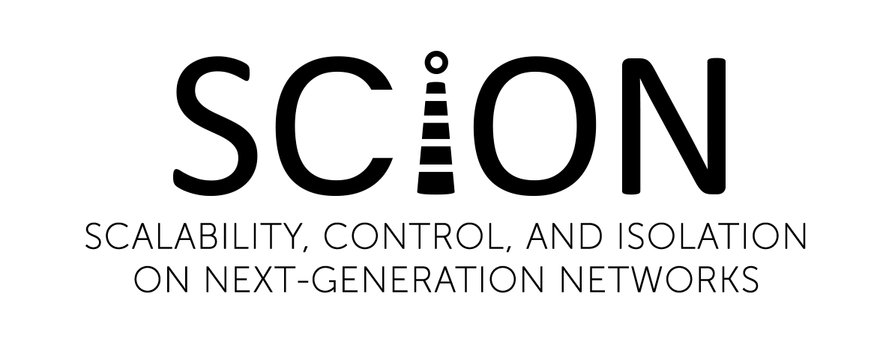

## SCION for Android

The [SCION](https://www.scion-architecture.net/) Android app enables you to run a [SCION endhost](https://docs.scionlab.org/content/config/setup_endhost.html) on an Android smartphone.

### Getting Started

Clone this repository with `git clone --recurse-submodules https://github.com/ekuiter/scion-android.git`.

### License

This program is free software: you can redistribute it and/or modify it under the terms of the GNU General Public License as published by the Free Software Foundation, either version 3 of the License, or (at your option) any later version.

This program is distributed in the hope that it will be useful, but WITHOUT ANY WARRANTY; without even the implied warranty of MERCHANTABILITY or FITNESS FOR A PARTICULAR PURPOSE.
See the [GNU General Public License](LICENSE.md) for more details.

You should have received a copy of the GNU General Public License along with this program.  If not, see <https://www.gnu.org/licenses/>.

This software uses the following libraries:

- [AndroidX](https://developer.android.com/jetpack/androidx), used under the conditions of the [Apache License, Version 2.0](https://android.googlesource.com/platform/frameworks/support/+/androidx-master-dev/LICENSE.txt)
- [Material Components for Android](https://material.io/develop/android/), used under the conditions of the [Apache License, Version 2.0](https://github.com/material-components/material-components-android/blob/master/LICENSE)
- [android-file-chooser](https://github.com/hedzr/android-file-chooser), used under the conditions of the [Apache License, Version 2.0](https://github.com/hedzr/android-file-chooser/blob/master/LICENSE)
- [Markwon](https://noties.io/Markwon/), used under the conditions of the [Apache License, Version 2.0](https://github.com/noties/Markwon/blob/master/LICENSE)
- [Spongy Castle](https://rtyley.github.io/spongycastle/), used under the conditions of [their adaptation of the MIT X11 License](https://github.com/rtyley/spongycastle/blob/spongy-master/LICENSE.html)
- [toml4j](https://github.com/mwanji/toml4j), used under the conditions of [The MIT License](https://github.com/mwanji/toml4j/blob/master/LICENSE)

For more information on this project, contact the [NetSys group](http://www.netsys.ovgu.de/).

© 2019 Vera Clemens, Tom Kranz 
© 2020 Tom Heimbrodt, Elias Kuiter